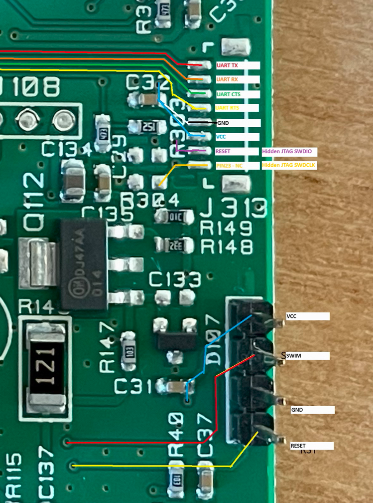

# Reverse Engineering

This directory contains info related to the reverse engineering work i've done on the Nespresso Expert.

## Interfacing

The mainboard exposes 3 interfaces. 1 via the 4 pin header that was presoldered on my board providing Single Wire Debug (SWD) interface for the STM8 chip and 2 via the unpopulated header above it UART & JTAG for the BL600-SA.

Check the images folder for high resolution images with the traces mapped.

The firmware from both chips has been extracted and uploaded to data\firmware.